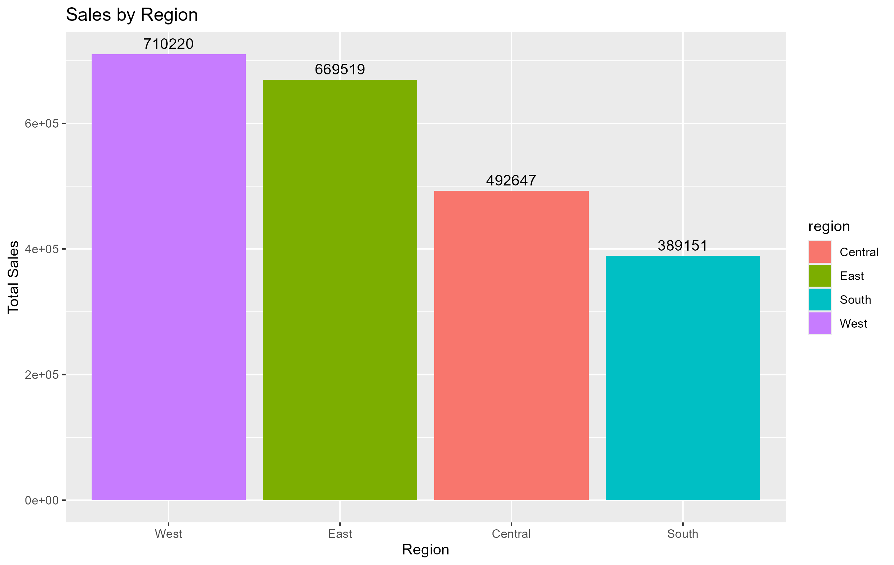
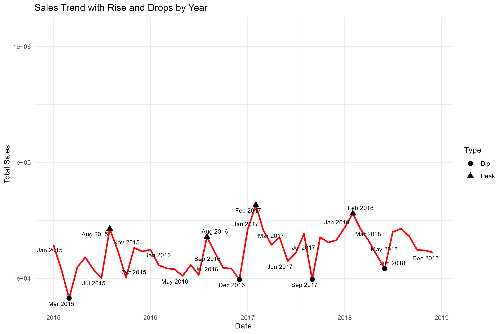
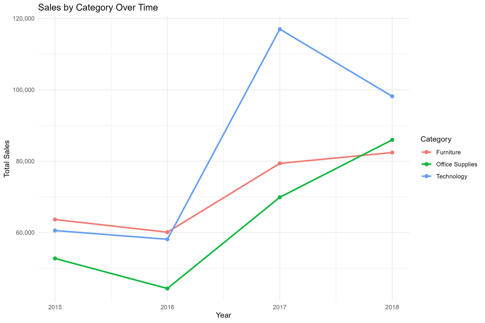
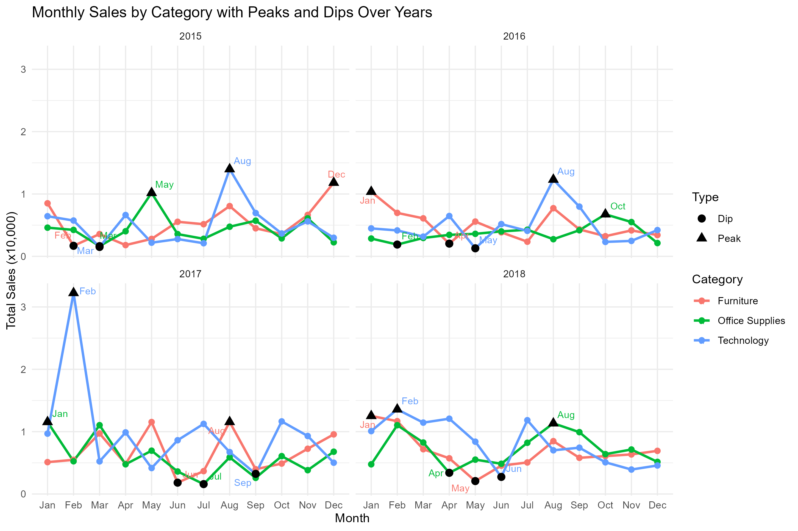
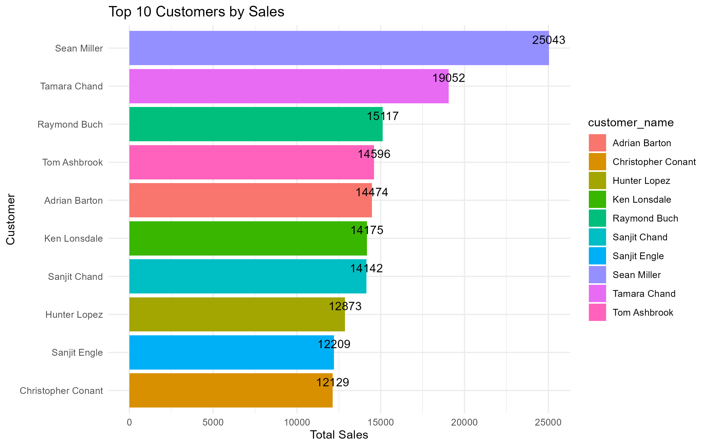
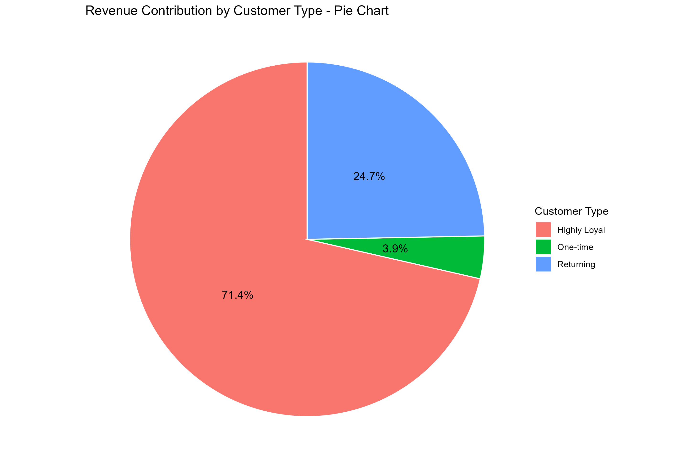
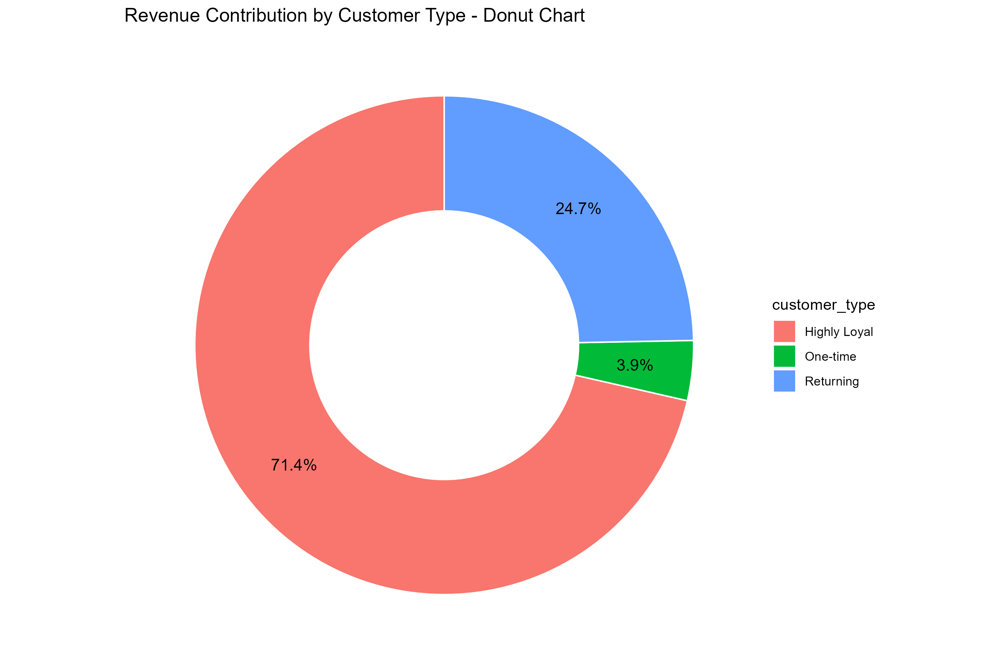

# 📊 Retail Sales Analysis (R Project)

## 📌 Objective

Analyze retail sales data to identify - revenue drivers, - regional
performance, and - customer trends.

## 🛠 Tools Used

-   R (tidyverse, ggplot2)
-   R (lubridate)
-   R (janitor)
-   Data Cleaning & Visualization

## 📂 Dataset

Superstore Sales Dataset (Kaggle)

## 🔍 Key Analysis

### 1. Sales by Category

<figure>

<figcaption aria-hidden="true">Sales by Category</figcaption>
</figure>

**Insight:** Technology generates the highest sales, indicating strong
customer demand and making it the primary revenue driver for the
business. Followed by Office Supplies, and finally furniture.

### 2. Sales by Region

<figure>

<figcaption aria-hidden="true">Sales by Region</figcaption>
</figure>

**Insight:** The West region leads in total sales, suggesting higher
market demand or stronger business presence in that area and therefore
shows the strongest performance.

### 3.1 Monthly Sales Trend by Year

<figure>

<figcaption aria-hidden="true">Monthly Trend By Year</figcaption>
</figure>

**Insight:** Sales shows seasonal patterns with peaks in early months
and August, followed by a mid-year dip. Trends remain consistent across
years, though some anomalies due to missing data should be addressed.

### 3.2 Sales Trend with Rise and Drops by Year

<figure>

<figcaption aria-hidden="true">Sales Trend with Rise and Drops by
Year</figcaption>
</figure>

**Insight:** I worked on the time-based features such as Year from the
transaction date to enable year-over-year comparison and identification
of peak and low-performing months.

### 3.3 Sales of Categories Trend over Years

<figure>

<figcaption aria-hidden="true">Sales of Categories Trend over
Years</figcaption>
</figure>

**Insight:** Sales across all categories show a steady upward trend over
time, indicating overall business growth. Technology being the highest
and fast-growing category (indicating revenue driver), contributing the
largest share of revenue, while Office Supplies shows stable and
consistent growth (showing a reliable baseline revenue). Furniture
exhibits more variability, suggesting it is possibly affected by
pricing, logistics, or customer demand fluctuations.

### 3.4 Monthly Sales by Category with Peaks and Dips Over Years

<figure>

<figcaption aria-hidden="true">Monthly Sales by Category with Peaks and
Dips Over Years</figcaption>
</figure>

**Insight:** Sales patterns vary across categories, with distinct peak
and low-performing months each year. While Technology consistently
achieves higher peaks, all categories exhibit seasonal fluctuations,
highlighting opportunities for targeted marketing during high-demand
periods and improvement strategies during slower months.

### 4.1 Top Customers

<figure>

<figcaption aria-hidden="true">Top Customers</figcaption>
</figure>

**Insight:** A small group of customers contributes a significant
portion of total sales, highlighting opportunities for targeted
retention strategies.

### 4.2 Revenue Contribution by Customer Type (loyal, returning, and one-time)

<figure>

<figcaption aria-hidden="true">Revenue Contribution by Customer Type
1</figcaption>
</figure>

<figure>

<figcaption aria-hidden="true">Revenue Contribution by Customer Type
2</figcaption>
</figure>

**Insight: ** Revenue concentration among repeat customers suggests that
it is a significant revenue driver, and highlighting the importance of
customer retention which could yield higher returns than focusing solely
on customer acquisition.

## 💡 Conclusion

This analysis highlights key revenue drivers and customer trends,
providing insights that can support better business decision-making.

## 🚀 Skills Demonstrated

-   Data cleaning
-   Data transformation
-   Data visualization
-   Business insight generation
